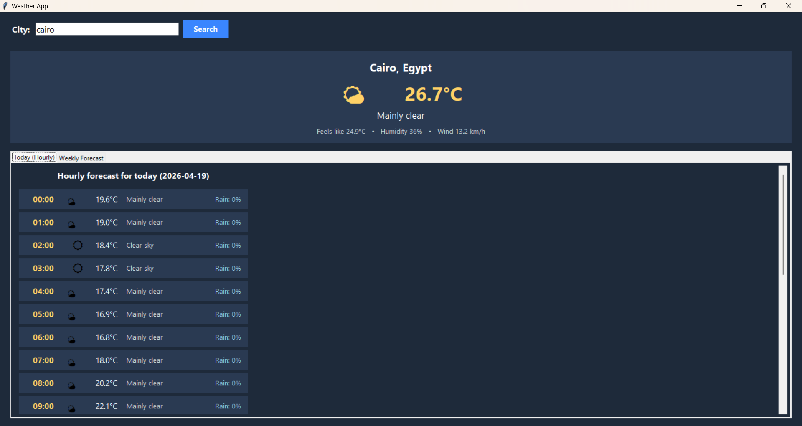
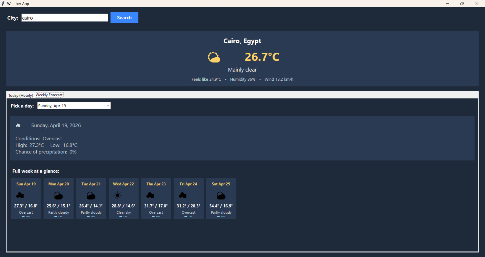

# 🌤️ Weather App

A clean, modern desktop Weather App built with Python and Tkinter. It lets you search any city in the world and view the current conditions, an hour-ekly forecast with daily highs/lows and conditions
- 🎨 Dark, minimal UI with weather-code icons
- - 🆓 No API key needed — uses Open-Meteo + Geocoding APIs
  -
  - ## 📸 Screenshots
  -
  - ### Hourly Forecast
  - 
  -
  - ### Weekly Forecast
  - 
  -
  - ## 🛠️ Tech Stack
  -
  - - **Language:** Python 3
    - - **GUI:** Tkinter (built-in, with `ttk` widgets)
      - - **APIs:**
        -   - [Open-Meteo Weather API](https://open-meteo.com/) — forecast data
            -   - [Open-Meteo Geocoding API](https://open-meteo.com/en/docs/geocoding-api) — city → coordinates
                - - **Networking:** `urllib` (standard library)
                  - - **Data handling:** `json`, `datetime`
                    -
                    - ## 📦 Requirements
                    -
                    - - Python 3.8 or newer
                      - - No external packages required — everything runs on the Python standard library.
                        -
                        - ## 🚀 Getting Started
                        -
                        - Clone the repository and run the app:
                        -
                        - ```bash
                          git clone https://github.com/RandomMoaz/Weather--app.git
                          cd Weather--app
                          python app.py
                          ```

                          ## 🖱️ Usage

                          1. Launch the app by running `python app.py`.
                          2. 2. Type a city name (e.g. `Cairo`, `London`, `Tokyo`) into the **City** field.
                             3. 3. Click **Search**.
                                4. 4. Browse the two tabs:
                                   5.    - **Today (Hourly)** — 24-hour forecast for the current day.
                                         -    - **Weekly Forecast** — pick any day from the dropdown for details, and see the full week at a glance.
                                              -
                                              - ## 📁 Project Structure
                                              -
                                              - ```
                                                Weather--app/
                                                ├── app.py            # Main application (GUI + API logic)
                                                ├── hourly_view.png   # Screenshot: hourly forecast view
                                                ├── weekly_view.png   # Screenshot: weekly forecast view
                                                └── README.md         # You are here
                                                ```

                                                ## 🙏 Credits

                                                - Weather data provided by [Open-Meteo](https://open-meteo.com/)
                                                - - Built with ❤️ by [RandomMoaz](https://github.com/RandomMoaz)
                                                  -
                                                  - ## 📄 License
                                                  -
                                                  - This project is open source. Feel free to use, modify, and share it.
                                                  - by-hour forecast for today, and a full 7-day outlook — all powered by the free Open-Meteo API (no API key required).

## ✨ Features

- 🔍 Search weather for any city worldwide
- - 🌡️ Current conditions: temperature, "feels like", humidity, wind speed
  - - ⏰ Hourly forecast for the current day
    - - 📅 We
